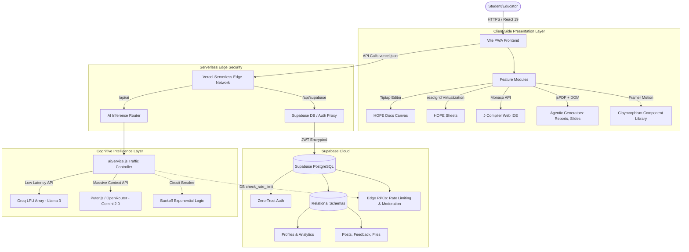
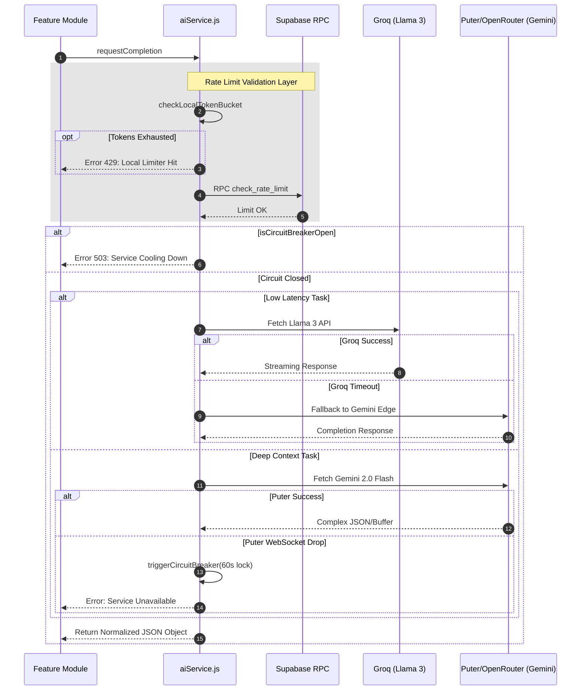
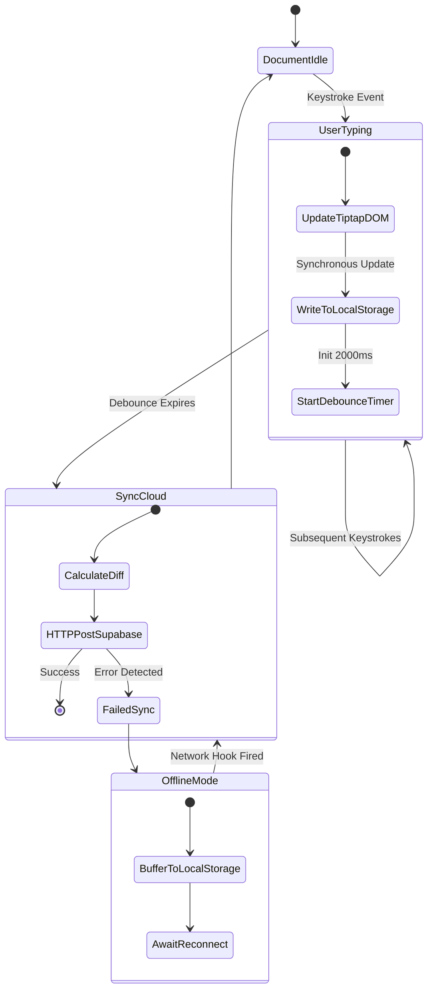
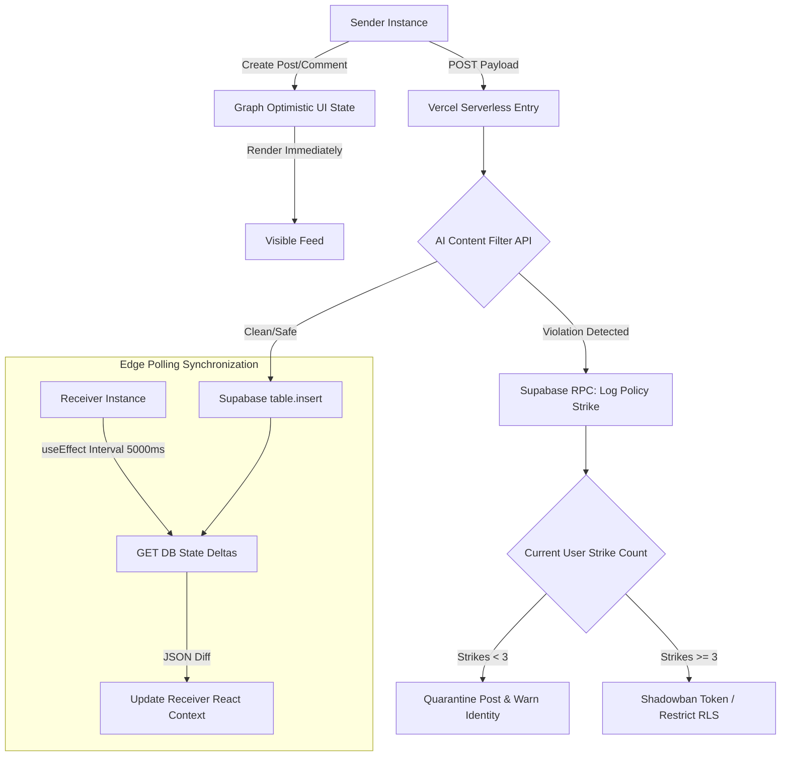
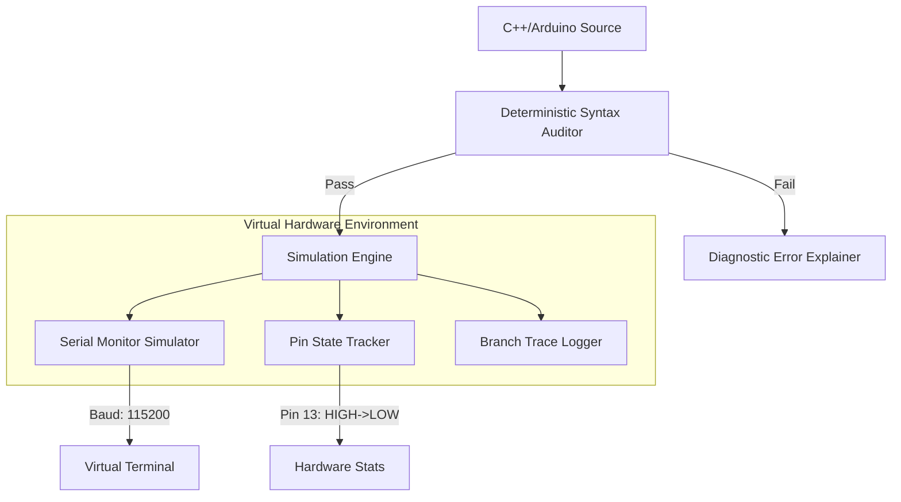

<div align="center">
  
  
  
  
  
  
  <br/><br/>
  
  <h1>🎓 HOPE-Edu-Hub: The Academic Super-Platform</h1>
  <p><b>A highly advanced, AI-native educational ecosystem architected to redefine the digital learning experience.</b></p>
</div>

---

**HOPE-Edu-Hub** transcends traditional Learning Management Systems (LMS) by acting as a localized intelligence node. It transforms static study materials into dynamic, interactive, and autonomous agent-driven learning loops. It synthesizes specialized cognitive AI mentors, multi-modal content generation pipelines (text, code, diagrams, slide decks), and a pro-grade productivity suite into a cohesive Progressive Web App (PWA).

This documentation serves as a comprehensive architectural blueprint detailing the edge computing strategies, fail-safe AI pipelines, UI state machines, and cryptographic data isolation layers employed in the ecosystem.

---

## 🗺️ Master System Topology

The platform operates on a decentralized edge architecture, heavily utilizing Vercel's serverless infrastructure to proxy sensitive Supabase RPC definitions and LLM API keys.



---

## 🧠 The AI Nervous System (`aiService.js`)

At the core of the platform is a deeply engineered, fault-tolerant AI routing layer. It does not blindly relay API calls; it manages computational resources, connection latency, and massive context windows dynamically.

### Dynamic Multi-Provider Routing & Circuit Breaking

The platform utilizes a dual-path routing schema to balance speed and intelligence, enforced by localized circuit breakers.



### Prompt Engineering & Security Constrains
The AI router actively sanitizes inbound user prompts. It injects strict cognitive constraints before the payload ever reaches external LLMs. For instance, the system explicitly configures system roles for distinct operational tasks: 
* The zero-to-hero chat prevents direct code answers. 
* The math assignment solvers mandate LaTeX/KaTeX outputs strictly mapped to arrays representing variables, logic equations, and final answers natively.

---

## ✍️ Document & Productivity Architectonics

### HOPE Docs: Debounced Dual-Persistence

HOPE Docs is designed to replace proprietary word processors natively in the browser. It features a headless `Tiptap` core that visually simulates physical A4 paper bounds. To guarantee zero data loss on unstable campus networks, it utilizes an Optimistic-Local-First persistence engine.



### HOPE Sheets: Virtualization Algorithms
Standard HTML `<table>` elements cause severe browser stalling beyond 1000 cells. HOPE Sheets implements `@silevis/reactgrid`.
- **Viewport Culling**: Only the immediately visible cells (e.g., A1 through Z40) plus a small scroll buffer exist in the physical DOM.
- **O(1) Locality Modifications**: Grid updates (like a massive sum formula) are mapped via specific 2D array matrix coordinates, triggering re-renders *only* for mathematically impacted cells rather than updating the entire application state tree.

---

## 🤖 Advanced Generative Pipelines

### The Autonomous Report Generator Workflow (`ReportGenerator.jsx`)
The Agentic Report Generator does not simply act as a wrapper for ChatGPT. It is an organized, multi-stage recursive pipeline that constructs an academic paper structurally.

```mermaid
graph LR
    subgraph PreFlight [Pre-Flight Configuration]
        User[User Config] -->|"Topic, Audience, Tone"| BG[Blueprint Node]
    end
    
    BG -->|"JSON Schema: Section Array"| ORC[Agentic Orchestrator Queue]
    
    subgraph AutoSynthesis [Autonomous Synthesis Loop]
        ORC --> S1[Gen: Section 01]
        S1 -->|"Section 01 Content"| C1[Context Buffer]
        
        C1 --> S2[Gen: Section 02]
        S2 -->|"Section 01 & 02"| C2[Context Buffer]
        
        C2 --> SN[Gen: Section N]
    end
    
    SN --> Canvas[A4 Rich Text Canvas Injection]
    
    subgraph PostFlight [Post-Flight Editing]
        Canvas --> CP[Sidebar Co-Pilot Tool]
        CP -->|"Co-Pilot Refinement"| ReGen[Block-Level Regeneration]
        ReGen --> Canvas
        Canvas -->|"jsPDF A4 Parsing"| PDF[Academic PDF Export]
    end
```



### Agentic Slides Generation Engine (`AgenticPPTGenerator.jsx`)
- **Beyond Template Limitations**: Eschews string-replacement inside static PPTX templates. The engine forces the AI to construct responsive, DOM-native HTML/CSS inline architectures for *every single slide element*.
- **IFrame Sandboxing**: Results are previewed inside isolated `<iframe>` sandboxes representing Desktop/Mobile viewports before rendering down to deployable web stacks.
- **JSON-to-DOM Pipeline**: The AI generates normalized JSON mappings detailing gradients, typography choices (mapped to dynamic Google Fonts), and layout nodes (Hero text vs side-by-side imagery) before translating to raw valid HTML.

### Analytical Assignment Solver (`AssignmentGenerator.jsx`)
The solver engine is meticulously fine-tuned for STEM requirements.
- **Cognitive Decomposition**: Instead of returning a wall of text, it parses equations and extracts explicit states: `Givens -> Formula Required -> Methodological Steps -> Solution Box`.
- **Internal Scoring Metric**: The engine self-evaluates the output structure against a rubric, generating a "Confidence Score out of 100" mapped onto the exported PDF header natively.
- **KaTeX DOM Mounting**: Outputs are rigorously wrapped in safe math environments for zero-flash equation rendering via KaTeX.

### Binary Abstraction: Handbook Generator (`HandbookGenerator.jsx`)
- **Recursive PDF Extraction**: Capable of reading raw uploaded PDFs on the client-side using `pdf.js` worker threads. The raw text buffers are then chunked mapped into overlapping AI execution queries.
- **Knowledge Synthesis**: Reconstructs dense course documents into digestible "Cheat Sheets" with bullet mapping, completely bypassing server persistence to protect document confidentiality.

---

## 🌐 Decentralized Community Engine (`CommunityFeed.jsx`)

The HOPE Community hub is a safe, peer-to-peer discussion forum. Because serverless compute environments natively struggle with persistent WebSocket connections, the feed is optimized around high-frequency HTTP polling masked by sophisticated Optimistic UI algorithms.

### Trust & Safety: Automated Auto-Moderation Engine



### Gamification Architecture & Subsystems
- **HOPE Coins Logic**: Integrated directly into Postgres functions. Users accumulate transactional tokens ("HOPE Coins") upon receiving verified upvotes or completing full Pomodoro focuses.
- **Database Abstraction**: `update_coins` executing via Supabase RPC ensures that clients cannot spoof token acquisitions locally by adjusting JS state arrays.

---

## 💻 Code Studio & Systems Engineering Interface

### J-Compiler Web IDE
- **Multi-Environment Sandbox**: Wraps the Monaco Editor API, executing parsing logic for Python, Javascript, and C++.
- **Hardware Serial Monitor Simulator**: Simulates deeply accurate Arduino/ESP32 boot sequences, memory heap allocations, and baud-rate standard outputs directly into a virtual terminal element.
- **AST to Mermaid Visualization**: Ingests student logic block graphs via AI transpilation nodes to visually map algorithmic execution loops (e.g., recursive calls mapped as flowchart branches).

### The Project Designer Simulator (`ProjectDesigner.jsx`)
Features a highly advanced `react-resizable-panels` layout functioning as a complete IDE suite.
- Generates internal folder structures (`package.json`, `index.js`, styling configs) from high-level objectives.
- Synthesizes an accompanying Pitch Deck and deployment architectural map automatically relative to the boilerplate code generated.

### Zero-to-Hero: Socratic Cognitive Engineering (`HeroChat.jsx`)
Instead of standard AI copying interfaces, the **ZeroToHero** module trains the specific cognitive loop required for system engineering:
- **Refusal Algorithms**: Programmed strictly to refuse outputting raw code unless the student has mapped the constraints.
- **The Protocol Pipeline**: Mentoring operates linearly: `Deconstruction (I/O mapping) -> Algorithm Logic (Pseudo-code) -> Edge Case Analysis -> Translation (Syntax)`.

---

## 🔐 Cryptographic Isolation & Trust Layers (Supabase)

### Row Level Security (RLS) Mandates
All structured tables (Profiles, Spreadsheets, Docs, Timers) execute on a zero-trust model.
- `auth.uid() === user_id` validations run immutably on the PostgreSQL edge. Compromised client-side session tokens mathematically cannot laterally access other tenants' academic records or raw data.
- Hardened `INSERT/UPDATE` schemas prevent client-side modifications of internal analytics (e.g., preventing manipulation of the 'HOPE Coin' balance schema or Auto-Mod strike logs).

### Authentication & Profile Standardization (`Registration.jsx`)
- Supports passwordless OTP magic links alongside rigorous multi-step department and demographic abstraction during the first sign-up to optimize metadata for specific "AI Analogy" preferences (e.g., Computer Science students receive debugging metaphors, History students receive timeline analogies in zero-to-hero chat).

---

## 📂 Exhaustive Core Directory Atlas

```bash
├── api/                        # Vercel Serverless Computing Definitions
│   └── supabase.js             # Obfuscated Proxy Endpoints
├── src/
│   ├── components/             # Domain-Driven Design (Isolated Modules)
│   │   ├── Assignment/         # Math solver loops & rubric PDF generation
│   │   ├── CourseMap/          # Syllabus abstraction to node-graph logic 
│   │   ├── Dashboard/          # Analytics sync, Auth layout structures
│   │   ├── Flashcards/         # State engines for Spaced Repetition algorithms
│   │   ├── Handbook/           # PDF binary to Text array abstraction
│   │   ├── HopeDocs/           # Debounced Auto-save and Tiptap hooks
│   │   ├── HopeSheets/         # Coordinate virtualization matrices
│   │   ├── Presentation/       # HTML slide injection sandboxes
│   │   ├── Project/            # Web IDE parsing & multi-pane resizers
│   │   ├── Report/             # Context window chunking orchestrators
│   │   ├── ZeroToHero/         # Prompt engineering restriction logic
│   │   └── common/             # Framer-Motion standardized geometry
│   │   
│   ├── utils/
│   │   ├── aiService.js        # Core API router, limiter, and circuit breaker
│   │   ├── assignmentAI.js     # Specialized prompt matrices for math
│   │   ├── handbookGenerator.js # PDF vision parsing integrations
│   │   └── reportAI.js         # The section-by-section context buffer
│   │
│   ├── App.jsx                 # react-router-dom tree & Context hooks
│   ├── Auth.jsx                # Edge token initialization state machine
│   ├── CommunityFeed.jsx       # Nested array recursion & polling UI
│   ├── Registration.jsx        # Data normalization for student domain/department entry
│   ├── index.css               # Tailwind v4 globals & Claymorphism physics specs
│   └── main.jsx                # React 19 Strict initialization
│
├── vercel.json                 # Infrastructure path rewriting & header security
├── vite.config.js              # PWA manifest caching logic & Rollup optimizations
├── .env.example                # Secret definitions (VITE_SUPABASE_URL)
└── package.json                # Dependencies map
```

---

## ⚙️ Development Initialization

### System Prerequisites
- **Node.js**: `v18.0.0` or higher required for edge-function local parity.
- **Supabase Instance**: An active PostgreSQL instance with defined RPC commands detailed in the architecture diagrams.

### Setup Protocol

1. **Clone the Infrastructure**
   ```bash
   git clone https://github.com/hope-int/IES-Notes.git
   cd IES-Notes
   ```

2. **Hydrate Virtual Environment**
   *CRITICAL IMPERATIVE: Because of deep structural manipulation required by `@tiptap` and `@silevis`, strict semantic versioning warnings must be bypassed locally using the legacy flag.*
   ```bash
   npm install --legacy-peer-deps
   ```

3. **Define Environment Secrets**
   Initialize the localized environment maps:
   ```env
   VITE_SUPABASE_URL=YOUR_SECURE_SUPABASE_ENDPOINT
   VITE_SUPABASE_ANON_KEY=YOUR_SECURE_ANONYMOUS_KEY
   VITE_APP_URL=http://localhost:5173 
   VITE_APP_ENV=development
   ```

4. **Initialize Local Node**
   Boots the Vite Hot-Module-Replacement (HMR) server aggressively optimized for parallel JSX processing frames.
   ```bash
   npm run dev
   ```

---

## 🚀 Recent Core Infrastructure Upgrades (March 2026)

The platform has recently undergone a major architectural hardening phase, introducing high-fidelity simulation and deterministic AI fallback protocols to ensure 100% uptime for safety-critical student code analysis.

### 1. The "Alpha-Prime" AI Fallback & Telemetry Engine
The routing layer in `aiService.js` has been upgraded from a simple fallback to a **Deterministic Multi-Engine Hierarchy**. This protocol ensures that complex reasoning tasks (like debugging or roadmap generation) never fail due to API rate limits.

- **Hierarchy Order**: `Puter.js (Cloud Native)` → `OpenRouter (Standard Edge)` → `Groq (Low Latency Fallback)`.
- **Telemetry Integration**: Every completion now injects a metadata object into the UI header, tracking:
    - **`latency`**: Exact round-trip time (RTT) for inference in seconds.
    - **`active_engine`**: Real-time identification of the provider (e.g., Puter vs. Groq).
    - **`model_id`**: The specific model string leveraged (e.g., `arcee-ai/trinity-large-preview`).
- **Circuit Breaker 2.0**: Implements a sliding window failure counter. If a provider returns 3 consecutive `5xx` or `429` errors, it is globally locked for 300 seconds, shifting all traffic to secondary nodes.

### 2. J-Compiler Virtual Hardware Emulation (VHE)
The J-Compiler is no longer just a syntax highlighter; it is a **Virtual Execution Sandbox** for both high-level and embedded languages.



- **Loop Cyclicity**: For Arduino/ESP32 code, the simulator forces a minimum of **two recursive cycles** of `void loop()` after `void setup()`, ensuring that state changes (like blinking patterns or variable increments) are captured in the telemetry log.
- **Diagnostic Reporting**: Replaces generic "Build Success" messages with a raw terminal output simulation, providing detailed step-by-step logs of compilation, link-time assumptions, and memory heap snapshots.

### 3. Hardened Visual Trace Execution (VTE)
A proprietary logic-to-diagram transpilation layer mapping code control flow directly into Mermaid.js format.

- **Label Hardening**: To prevent Mermaid syntax crashes, the system now enforces a **Strict Quoting Protocol** for node labels. All dynamic code tokens are escaped and wrapped in square brackets `[ "label" ]` to handle non-alphanumeric characters.
- **Logical Branching**: Automatically detects `if-else` and `switch` blocks, mapping them as decision diamonds in the flow graph, providing students with a visual mental model of their algorithm.

### 4. AI Tutor 2.0: Arcee-Trinity Cognitive Layer
The AI Tutor has been upgraded with the **Arcee Trinity Large** preview model, optimized for deep reasoning and educational deconstruction.

- **Forced Contrast CSS**: To overcome conflicts with Tailwind's `.prose` layer, the chat screen now utilizes a **Scoped Style Injector**. This injects high-priority `!important` CSS rules directly into the DOM during runtime to maintain high-contrast light theme containers for code blocks.
- **Multi-Modal Brain**: Synchronized routing between Arcee (for reasoning) and Nemotron (for vision-based note analysis).

---


<div align="center">
  <b>Built for Depth. Engineered for Scale.</b><br/>
  Designed by the <b>HOPE Team</b><br/>
  <i>Pioneering the mathematical boundary between Cognitive AI and Applied Education.</i>
  <br/><br/>
  <sup>© 2026 HOPE INT. All proprietary routing algorithms and architecture definitions reserved within repository scope.</sup>
</div>
